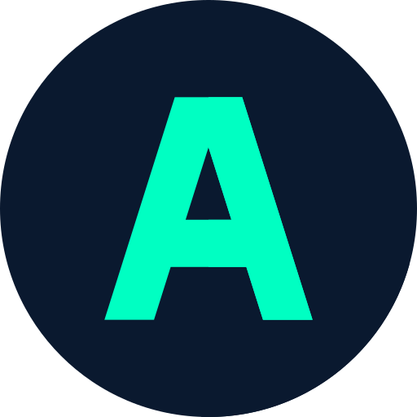

<!-- PROJECT LOGO -->
<br />
<p align="center">
  <a href="https://aaryan-r-s.github.io/Portfolio">
    
  </a>

  <h3 align="center">Web Porfolio</h3>

  <p align="center">
    An awesome project to build your own website!
    <br />
    <strong>Explore the docs »</strong>
    <br />
    <br />
    <a href="https://aaryan-r-s.github.io/Portfolio">View Demo</a>
    ·
    <a href="https://github.com/Aaryan-R-S/Portfolio/issues">Report Bug</a>
    ·
    <a href="https://github.com/Aaryan-R-S/Portfolio/issues">Request Feature</a>
    <br />
</p>

**Project Link** -> [Click Here](https://aaryan-r-s.github.io/Portfolio)
<br>
**Source Code Link** -> [Click Here](https://github.com/Aaryan-R-S/Portfolio)
<br>

<!-- TABLE OF CONTENTS -->
<details open="open">
  <summary>Table of Contents</summary>
  <ol>
    <li>
      <a href="#about-the-project">About The Project</a>
      <ul>
        <li><a href="#built-with">Built With</a></li>
      </ul>
    </li>
    <li>
      <a href="#getting-started">Getting Started</a>
      <ul>
        <li><a href="#prerequisites">Prerequisites</a></li>
        <li><a href="#installation">Installation</a></li>
      </ul>
    </li>
    <li><a href="#roadmap">Roadmap</a></li>
    <li><a href="#contributing">Contributing</a></li>
    <li><a href="#license">License</a></li>
    <li><a href="#contact">Contact</a></li>
    <li><a href="#acknowledgements">Acknowledgements</a></li>
  </ol>
</details>


<!-- ABOUT THE PROJECT -->
## About The Project

![Product Name Screen Shot][product-screenshot]

This is My Web Portfolio including resume! I needed a website for myself so I decided to build it with the help of a JavaScript framework named AngularJS.

### Built With

* [HTML](https://www.w3schools.com/html/)
* [CSS](https://www.w3schools.com/css/default.asp)
* [Bootstrap](https://getbootstrap.com)
* [JavaScript](https://www.javascript.com/)
* [jQuery](https://jquery.com)
* [Node.js](https://nodejs.org/en/)
* [AngularJS](https://angularjs.org/)
* [GitHub](https://github.com)


<!-- GETTING STARTED -->
## Getting Started

To get a local copy up and running follow these simple steps.

### Prerequisites

1. GitHub Account ([Sign Up](https://github.com))
2. AngularJS Basics ([Watch Tutorial](https://www.youtube.com/watch?v=k5E2AVpwsko))


### Installation

- Clone the repo
   ```sh
   git clone https://github.com/Aaryan-R-S/Portfolio.git
   ```
- Install Node.js ([Click here](https://nodejs.org/en/download/))
- npm 
  ```sh
  npm install npm@latest -g
  ```
- Install NPM packages
   ```sh
   npm install
   ```
- Install Angular Cli ([Click Here](https://angular.io/cli))
- ng serve
- ng build --prod --baseHref="https://aaryan-r-s.github.io/Portfolio/"   
   

<!-- ROADMAP -->
## Roadmap

Clone the repo and open it in suitable IDE for complete project backend code. You can also fix the issues and hence contribute.


<!-- CONTRIBUTING -->
## Contributing

Contributions are what make the open source community such an amazing place to be learn, inspire, and create. Any contributions you make are **greatly appreciated**.

1. Fork the Project
2. Create your Feature Branch (`git checkout -b feature/AmazingFeature`)
3. Commit your Changes (`git commit -m 'Add some AmazingFeature'`)
4. Push to the Branch (`git push origin feature/AmazingFeature`)
5. Open a Pull Request

<!-- LICENSE -->
## License

Feel free to clone and modify according to your needs. But please give desirable CREDITS and STAR this repository!<br> Distributed under the MIT License. See `LICENSE` for more information.


<!-- CONTACT -->
## Contact

Email ID - aaryan20004@iiitd.ac.in

Project Link - [https://aaryan-r-s.github.io/Portfolio](https://aaryan-r-s.github.io/Portfolio)


<!-- ACKNOWLEDGEMENTS -->
## Acknowledgements
* [Design Credits - Brittany Chiang](https://brittanychiang.com)
* [AngularJS Tutorial @Code With Harry](https://youtu.be/0LhBvp8qpro)
* [Web Development Bootcamp @Code with Harry](https://youtube.com/playlist?list=PLu0W_9lII9agiCUZYRsvtGTXdxkzPyItg)
* [Best README Template](https://github.com/othneildrew/Best-README-Template)
* [Flaticon](https://flaticon.com)


<!-- MARKDOWN LINKS & IMAGES -->
[product-screenshot]: readme-images/ss.png
